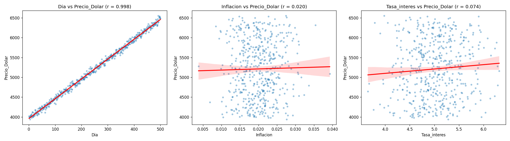
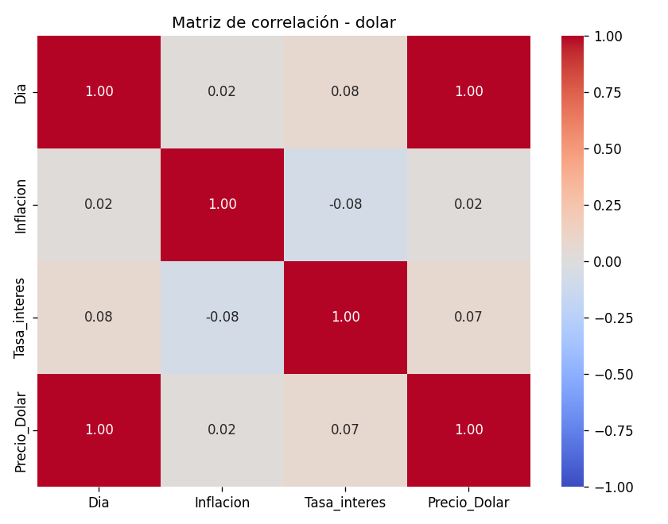
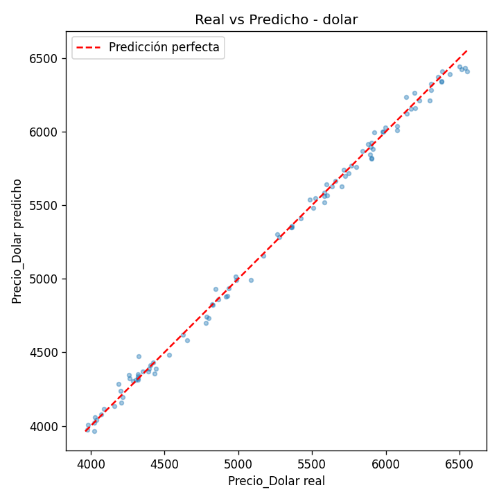
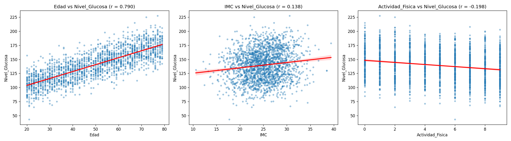
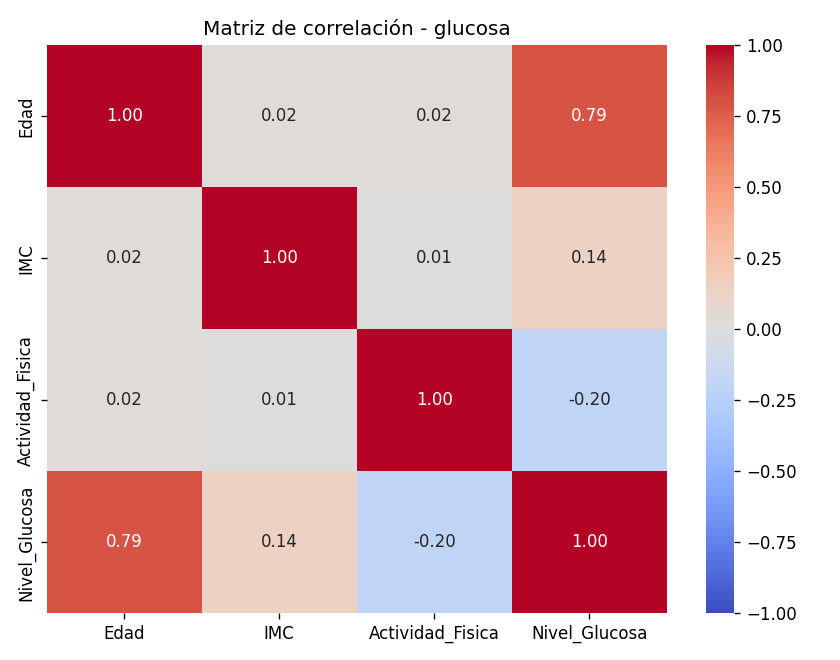
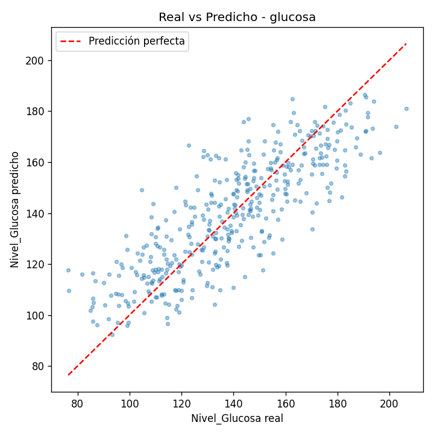
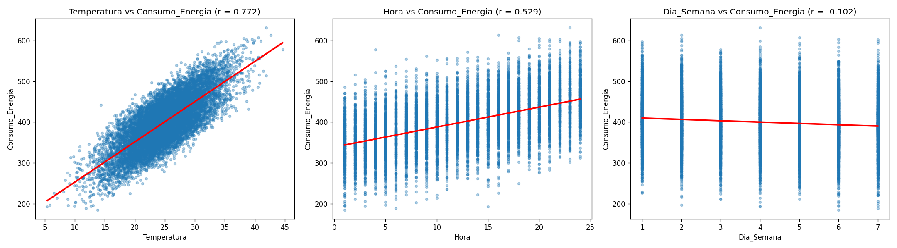
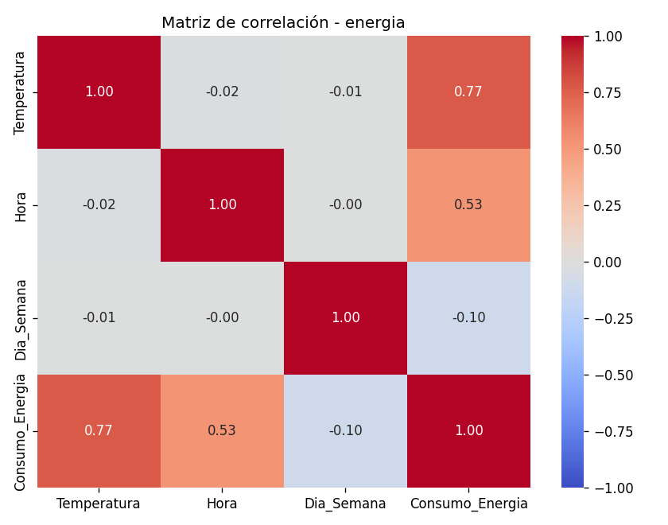
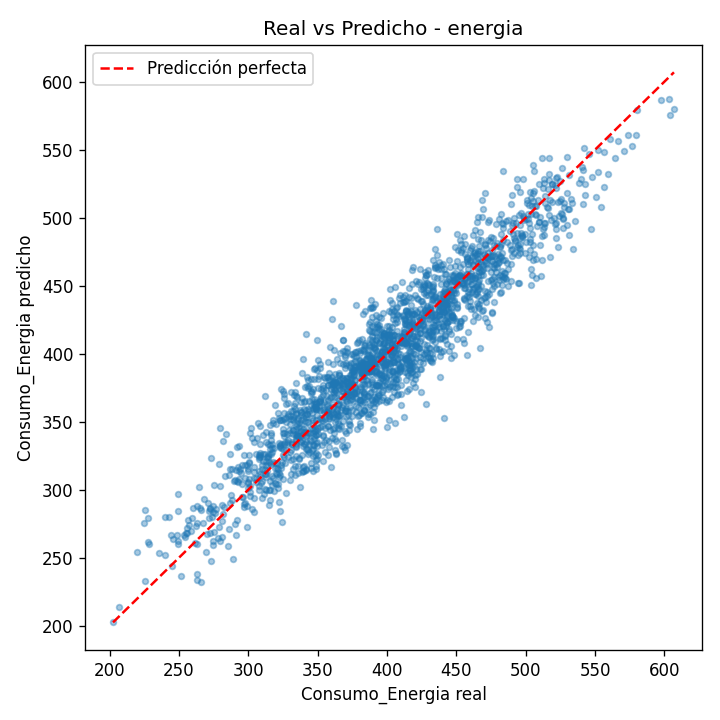

# Laboratorio 1 – Minería de Datos
## Regresión lineal múltiple aplicada con CRISP-DM

Este laboratorio aplica las fases de la metodología **CRISP-DM** para construir tres modelos de **regresión lineal múltiple**:

| Ejercicio | Dataset | Variables independientes (X) | Variable dependiente (y) |
|---|---|---|---|
| 1. Dólar | `data/dolar_data.csv` (500 filas) | Dia, Inflacion, Tasa_interes | Precio_Dolar |
| 2. Glucosa | `data/glucosa_data.csv` (2000 filas) | Edad, IMC, Actividad_Fisica | Nivel_Glucosa (mg/dL) |
| 3. Energía | `data/energia_data.csv` (10000 filas) | Temperatura, Hora, Dia_Semana | Consumo_Energia (kWh) |

En cada ejercicio se interpretan los coeficientes, se evalúa el modelo (MSE, RMSE y R²), se grafican las relaciones, se exporta el modelo a `.joblib` y, al final, una **interfaz web en Streamlit** permite hacer predicciones con los tres modelos.

---

## Índice
1. [Cómo ejecutar](#1-cómo-ejecutar)
2. [Estructura del proyecto](#2-estructura-del-proyecto)
3. [Marco teórico](#3-marco-teórico)
4. [Resultados y análisis](#4-resultados-y-análisis)
5. [Conclusiones](#5-conclusiones)
6. [Explicación del código línea por línea](#6-explicación-del-código-línea-por-línea)

---

## 1. Cómo ejecutar

```bash
# 1. Instalar dependencias (una sola vez)
pip install -r requirements.txt

# 2. Entrenar los tres modelos (genera modelos/, graficas/ y resultados/)
python entrenar_todo.py

#    ...o cada ejercicio por separado
python ejercicio1_dolar.py
python ejercicio2_glucosa.py
python ejercicio3_energia.py

# 3. Abrir la interfaz web (se abre en http://localhost:8501)
streamlit run app.py
```

En la web: se elige el ejercicio en la barra lateral, se escriben los valores de las variables y se pulsa **Predecir**.

---

## 2. Estructura del proyecto

```
laboratorio/
├── data/                      Datasets originales (CSV)
├── comun.py                   Funciones reutilizables organizadas por fases CRISP-DM
├── ejercicio1_dolar.py        Ejercicio 1 – Precio del dólar
├── ejercicio2_glucosa.py      Ejercicio 2 – Nivel de glucosa
├── ejercicio3_energia.py      Ejercicio 3 – Consumo de energía
├── entrenar_todo.py           Ejecuta los tres ejercicios y muestra un resumen
├── app.py                     Interfaz web (Streamlit)
├── modelos/                   Modelos exportados: dolar.joblib, glucosa.joblib, energia.joblib
├── graficas/                  Gráficas PNG: relaciones, correlación y real vs. predicho
├── resultados/                Métricas (.txt), coeficientes (.csv) y salida de consola completa
├── requirements.txt           Librerías necesarias
└── README.md                  Este informe
```

Se decidió poner la lógica en `comun.py` porque los tres ejercicios siguen **exactamente los mismos pasos**; así cada script de ejercicio solo define *qué* datos usar, y `comun.py` define *cómo* procesarlos. Esto evita repetir código tres veces y garantiza que los tres modelos se evalúen igual.

---

## 3. Marco teórico

### 3.1 CRISP-DM
**CRISP-DM** (*Cross-Industry Standard Process for Data Mining*) es la metodología más usada en proyectos de minería de datos. Tiene 6 fases cíclicas:

| Fase | Qué se hace | Cómo se aplicó en este laboratorio |
|---|---|---|
| 1. Comprensión del negocio | Definir el problema y el objetivo | Cada script imprime el objetivo: predecir dólar, glucosa o energía |
| 2. Comprensión de los datos | Explorar los datos: tamaño, tipos, estadísticas, correlaciones | `explorar()`: forma, nulos, duplicados, `describe()` y correlación de Pearson |
| 3. Preparación de los datos | Limpiar, seleccionar variables, dividir datos | `preparar()`: elimina nulos/duplicados y separa 80 % entrenamiento / 20 % prueba |
| 4. Modelado | Elegir y entrenar la técnica | `entrenar()`: `LinearRegression` de scikit-learn; `interpretar()` e `importancia()` |
| 5. Evaluación | Medir si el modelo cumple el objetivo | `evaluar()`: MSE, RMSE, MAE y R² sobre datos de prueba + gráficas |
| 6. Despliegue | Poner el modelo en uso | `exportar()` a `.joblib` y la app web `app.py` |

### 3.2 Regresión lineal simple y múltiple
La **regresión lineal** modela una variable numérica (dependiente, *y*) como una combinación lineal de otras (independientes, *x*).

- **Simple** (una variable): ŷ = β₀ + β₁·x
- **Múltiple** (varias variables):

  **ŷ = β₀ + β₁·x₁ + β₂·x₂ + … + βₙ·xₙ**

  - **β₀ (intercepto):** valor esperado de *y* cuando todas las *x* valen 0.
  - **βᵢ (coeficiente):** cambio esperado en *y* cuando *xᵢ* aumenta **una unidad**, manteniendo las demás variables constantes (*ceteris paribus*).

### 3.3 Mínimos cuadrados ordinarios (MCO / OLS)
Los coeficientes se calculan buscando la recta (o hiperplano) que **minimiza la suma de los errores al cuadrado**:

  min Σ (yᵢ − ŷᵢ)²

La solución cerrada es **β = (XᵀX)⁻¹ Xᵀy**. Es lo que hace internamente `LinearRegression().fit()`.

### 3.4 Supuestos de la regresión lineal
1. **Linealidad:** la relación entre X e y es aproximadamente lineal.
2. **Independencia** de los errores.
3. **Homocedasticidad:** la varianza de los errores es constante.
4. **Normalidad** de los residuos.
5. **No multicolinealidad:** las variables independientes no deben estar muy correlacionadas entre sí.

Las matrices de correlación (`graficas/*_correlacion.png`) muestran que en los tres datasets las variables independientes casi no se correlacionan entre sí (la mayor correlación entre dos variables independientes es |r| = 0.076, en el dataset del dólar), así que no hay problema de multicolinealidad.

### 3.5 Importancia de variables: coeficientes estandarizados
Los coeficientes “crudos” **no se pueden comparar entre sí** porque cada variable tiene su propia unidad (días, años, °C…). Por ejemplo, en el dólar el coeficiente de Inflación es −870 y el de Día es 4.98, pero eso **no** significa que la inflación importe más: la inflación se mueve en rangos de 0.004 a 0.039.

Para comparar se usa el **coeficiente estandarizado (beta)**:

  **βᵢ* = βᵢ · (σₓᵢ / σᵧ)**

Indica cuántas desviaciones estándar cambia *y* cuando *xᵢ* cambia una desviación estándar. **El de mayor valor absoluto es la variable de mayor impacto.**

### 3.6 Métricas de evaluación
| Métrica | Fórmula | Interpretación |
|---|---|---|
| **MSE** (error cuadrático medio) | (1/n) Σ (yᵢ − ŷᵢ)² | Promedio de los errores al cuadrado. Penaliza mucho los errores grandes. Está en unidades², por eso cuesta interpretarlo. Menor = mejor. |
| **RMSE** (raíz del MSE) | √MSE | Error típico en **las mismas unidades** que *y*. Menor = mejor. |
| **MAE** (error absoluto medio) | (1/n) Σ \|yᵢ − ŷᵢ\| | Error promedio en valor absoluto. Menos sensible a valores extremos. |
| **R²** (coeficiente de determinación) | 1 − Σ(yᵢ − ŷᵢ)² / Σ(yᵢ − ȳ)² | Proporción de la variabilidad de *y* explicada por el modelo. 1 = perfecto, 0 = igual que predecir el promedio. |

### 3.7 División entrenamiento / prueba
Si se evalúa el modelo con los mismos datos con que se entrenó, las métricas salen optimistas. Por eso se separa un **20 % de los datos para prueba** (`train_test_split`) que el modelo nunca ve durante el entrenamiento. `random_state=42` fija la semilla para que la división (y los resultados) sean reproducibles.

### 3.8 Exportar modelos: pickle y joblib
Entrenar un modelo cada vez que se quiere usar no es práctico. **Serializar** es guardar el objeto de Python (con sus coeficientes ya calculados) en un archivo para cargarlo después.

- **pickle:** módulo estándar de Python. `pickle.dump(obj, open("m.pkl","wb"))` / `pickle.load(open("m.pkl","rb"))`.
- **joblib:** librería recomendada por scikit-learn; funciona igual pero es más eficiente con objetos que contienen arreglos NumPy grandes. `joblib.dump(obj, "m.joblib")` / `joblib.load("m.joblib")`.

En este laboratorio se usa **joblib** y se guarda un diccionario con el modelo **y** sus metadatos (lista de variables, nombre del objetivo, métricas), para que la app sepa en qué orden pedir los datos. Tras guardar, se recarga el archivo y se verifica que predice exactamente igual.

> Precaución: solo se deben cargar archivos `.pkl`/`.joblib` de fuentes confiables, porque al cargarlos se puede ejecutar código.

### 3.9 Streamlit
**Streamlit** es una librería de Python para crear aplicaciones web de datos sin escribir HTML ni JavaScript. Cada vez que el usuario interactúa con un control, **el script completo se vuelve a ejecutar de arriba a abajo**; por eso se usa `@st.cache_resource` para no recargar el modelo en cada ejecución, y `st.form` para que la predicción solo se calcule al pulsar el botón.

---

## 4. Resultados y análisis

Todos los valores de esta sección vienen de la ejecución real de `python entrenar_todo.py` (salida completa en `resultados/salida_consola.txt`). Las métricas se calculan sobre el **conjunto de prueba (20 %)**.

### Resumen

| Modelo | MSE | RMSE | MAE | R² | Variable de mayor impacto |
|---|---|---|---|---|---|
| Dólar | 2376.97 | 48.75 | 37.01 | **0.9963** | Dia |
| Glucosa | 233.69 | 15.29 | 12.22 | **0.6814** | Edad |
| Energía | 429.52 | 20.72 | 16.51 | **0.8968** | Temperatura |

---

### 4.1 Ejercicio 1 – Precio del dólar

**Ecuación del modelo:**

  Precio_Dolar = 3985.7833 + 4.9843·Dia − 870.7317·Inflacion − 1.3774·Tasa_interes

**Interpretación de los coeficientes:**

| Variable | Coeficiente | Coef. estandarizado | Correlación con y | Interpretación |
|---|---|---|---|---|
| Intercepto | 3985.78 | – | – | Precio base estimado en el “día 0”. |
| **Dia** | +4.9843 | **0.9976** | 0.9976 | Cada día que pasa, el dólar **sube ≈ 4.98 pesos**, con lo demás constante. Es una tendencia alcista casi perfecta. |
| Inflacion | −870.73 | −0.0061 | 0.0196 | Como la inflación diaria está en escala decimal (≈0.02), un aumento de **0.01** en la inflación baja el precio ≈ 8.7 pesos. Su efecto es prácticamente nulo. |
| Tasa_interes | −1.3774 | −0.0009 | 0.0743 | Por cada punto que sube la tasa, el dólar baja ≈ 1.38 pesos. Efecto despreciable. |

**Desempeño:** MSE = 2376.97, RMSE = 48.75 pesos, R² = 0.9963.
El modelo explica el **99.6 %** de la variación del precio. Un error típico de ~49 pesos sobre precios de 3 900 a 6 500 pesos es menor al 1 %.

**Análisis:** casi todo el poder predictivo viene de **Dia**, es decir, de la tendencia temporal. La inflación y la tasa de interés, en este dataset, no aportan información (correlación ≈ 0 y coeficientes estandarizados cercanos a 0). En la práctica esto significa que el modelo aprendió “el dólar sube ~5 pesos por día”; es muy preciso dentro del rango observado, pero **extrapolar a días futuros lejanos es riesgoso**, porque una tendencia lineal no se mantiene indefinidamente.

**Gráficas:**





---

### 4.2 Ejercicio 2 – Nivel de glucosa en sangre

**Ecuación del modelo:**

  Nivel_Glucosa = 65.8609 + 1.2266·Edad + 0.9334·IMC − 2.0853·Actividad_Fisica

**Interpretación de los coeficientes e importancia:**

| Ranking | Variable | Coeficiente | Coef. estandarizado | Correlación con y | Interpretación |
|---|---|---|---|---|---|
| – | Intercepto | 65.86 | – | – | Glucosa base teórica con todas las variables en 0. |
| **1** | **Edad** | +1.2266 | **0.7874** | 0.7898 | Cada año adicional de edad **aumenta ≈ 1.23 mg/dL** la glucosa. 10 años más ≈ +12.3 mg/dL. |
| 2 | Actividad_Fisica | −2.0853 | −0.2229 | −0.1984 | Cada hora semanal de ejercicio **reduce ≈ 2.09 mg/dL** la glucosa. Es un factor protector. |
| 3 | IMC | +0.9334 | 0.1359 | 0.1383 | Cada punto de IMC **aumenta ≈ 0.93 mg/dL** la glucosa. |

Nótese que Actividad_Fisica tiene el coeficiente crudo más grande (−2.09), pero **al estandarizar, Edad es claramente la más importante** (0.79 vs 0.22), porque la edad varía mucho más (desv. est. 17.5 años) que las horas de ejercicio (2.9 h).

**Desempeño:** MSE = 233.69, RMSE = 15.29 mg/dL, R² = 0.6814.
El modelo explica el **68 %** de la variación de la glucosa, con un error típico de ±15 mg/dL.

**¿Qué variable tiene mayor impacto? → La Edad**, con un coeficiente estandarizado 3.5 veces mayor que el de la actividad física y casi 6 veces mayor que el del IMC.

**Análisis:** el R² es moderado: queda un 32 % de variación no explicada. Esto es esperable en un fenómeno biológico, donde la glucosa depende de factores que no están en el dataset (genética, dieta, hora de la última comida, medicamentos, etc.). Los signos de los coeficientes son coherentes con la medicina: la glucosa aumenta con la edad y el IMC y disminuye con el ejercicio.

**Gráficas:**





---

### 4.3 Ejercicio 3 – Consumo de energía eléctrica

**Ecuación del modelo:**

  Consumo_Energia = 101.2882 + 9.9529·Temperatura + 5.0198·Hora − 3.0312·Dia_Semana

**Interpretación de los coeficientes e importancia:**

| Ranking | Variable | Coeficiente | Coef. estandarizado | Correlación con y | Interpretación |
|---|---|---|---|---|---|
| – | Intercepto | 101.29 | – | – | Consumo base teórico. |
| **1** | **Temperatura** | +9.9529 | **0.7803** | 0.7719 | Cada °C adicional **aumenta ≈ 9.95 kWh** el consumo (p. ej., más uso de aire acondicionado). |
| 2 | Hora | +5.0198 | 0.5464 | 0.5290 | Cada hora que avanza el día **aumenta ≈ 5.02 kWh** el consumo; el consumo es mayor en la tarde/noche. |
| 3 | Dia_Semana | −3.0312 | −0.0954 | −0.1022 | Cada día que avanza la semana (lunes → domingo) **reduce ≈ 3.03 kWh**; el fin de semana se consume un poco menos. |

**Desempeño:** MSE = 429.52, **RMSE = 20.72 kWh**, R² = 0.8968.
El modelo explica el **89.7 %** de la variación del consumo, con un error típico de ±20.7 kWh sobre consumos promedio de 400 kWh (≈5 %).

**¿Qué variable tiene mayor impacto? → La Temperatura**, seguida de la Hora. El día de la semana tiene un efecto pequeño.

**Análisis:** las gráficas de dispersión muestran una nube claramente alineada para Temperatura, una tendencia creciente escalonada para Hora y una línea casi plana para Dia_Semana. Una limitación: Hora y Dia_Semana son variables **cíclicas** (después de la hora 24 viene la 1), y el modelo lineal las trata como si 24 estuviera “lejos” de 1. En estos datos la relación con la hora es creciente y funciona bien, pero en un proyecto real convendría codificarlas con seno/coseno o variables dummy.

**Gráficas:**





---

### 4.4 Exportación e interfaz web
- Se generaron `modelos/dolar.joblib`, `modelos/glucosa.joblib` y `modelos/energia.joblib`. Al recargarlos, las predicciones fueron idénticas a las del modelo original (`Verificación al recargar: True`).
- La app `app.py` permite elegir el ejercicio, ingresar los valores por teclado y mostrar la predicción. Además muestra el R², MSE, RMSE y la ecuación del modelo. En glucosa indica el rango de referencia (normal / prediabetes / diabetes) como dato académico.
- Ejemplos con los valores por defecto de la app: Dólar (día 250, inflación 0.02, tasa 5) → **5 207.57 pesos**; Glucosa (45 años, IMC 25, 4 h) → **136.05 mg/dL**; Energía (25 °C, hora 12, lunes) → **407.32 kWh**.

---

## 5. Conclusiones
1. La metodología CRISP-DM dio un orden claro al trabajo: entender el problema, explorar, preparar, modelar, evaluar y desplegar. Separar la lógica común en `comun.py` permitió aplicar exactamente el mismo proceso a los tres problemas.
2. **Dólar (R² = 0.996):** el modelo es excelente, pero su precisión se debe casi solo a la tendencia temporal (Dia). Inflación y tasa de interés no aportan información en este dataset.
3. **Glucosa (R² = 0.681):** modelo aceptable. La **edad** es la variable de mayor impacto; el ejercicio reduce la glucosa y el IMC la aumenta. Hay factores no medidos que explican el resto de la variación.
4. **Energía (R² = 0.897):** buen modelo. La **temperatura** es el factor principal, seguida de la hora del día.
5. Comparar coeficientes crudos puede llevar a conclusiones erróneas; para medir importancia hay que usar **coeficientes estandarizados**.
6. Exportar los modelos con **joblib** permite usarlos en una aplicación sin volver a entrenarlos, y **Streamlit** permite construir la interfaz de predicción con pocas líneas de Python.

---

## 6. Explicación del código línea por línea

### 6.1 `comun.py` – funciones compartidas

**Importaciones (líneas 1–13)**

| Línea | Código | Qué hace |
|---|---|---|
| 1 | `"""Funciones compartidas..."""` | Docstring: describe el propósito del módulo. |
| 2 | `from pathlib import Path` | Importa `Path` para manejar rutas de archivos de forma segura en Windows/Linux. |
| 4 | `import joblib` | Librería para guardar y cargar el modelo entrenado. |
| 5 | `import matplotlib` | Librería base de gráficas. |
| 6 | `matplotlib.use("Agg")` | Usa un motor de dibujo sin ventana: las gráficas se guardan como PNG sin abrir ventanas que detengan el script. Debe ir **antes** de importar `pyplot`. |
| 7 | `import matplotlib.pyplot as plt` | Interfaz para crear figuras y ejes. |
| 8 | `import numpy as np` | Operaciones numéricas (raíz cuadrada, comparación de arreglos). |
| 9 | `import pandas as pd` | Manejo de tablas de datos (DataFrames). |
| 10 | `import seaborn as sns` | Gráficas estadísticas (dispersión con línea de regresión, mapa de calor). |
| 11 | `from sklearn.linear_model import LinearRegression` | Clase del modelo de regresión lineal. |
| 12 | `from sklearn.metrics import ...` | Funciones para calcular MAE, MSE y R². |
| 13 | `from sklearn.model_selection import train_test_split` | Función para dividir en entrenamiento y prueba. |

**Rutas del proyecto (líneas 15–26)**

| Línea | Qué hace |
|---|---|
| 16 | `BASE = Path(__file__).resolve().parent` → carpeta donde está `comun.py`. Así el código funciona sin importar desde qué carpeta se ejecute. |
| 17–20 | Construye las rutas de `data/`, `modelos/`, `graficas/` y `resultados/` con el operador `/` de `Path`. |
| 21–22 | Recorre las carpetas de salida y las crea si no existen (`exist_ok=True` evita error si ya existen). |
| 25–26 | `titulo(texto)`: imprime un encabezado entre líneas de `=` para separar visualmente cada fase en la consola. |

**Fase 2 – Comprensión de los datos (líneas 29–41)**

| Línea | Qué hace |
|---|---|
| 30–31 | `cargar_datos`: lee el CSV de la carpeta `data/` y lo devuelve como DataFrame. |
| 34 | `explorar(df, objetivo)`: recibe los datos y el nombre de la variable dependiente. |
| 35 | Imprime el encabezado de la fase. |
| 36 | `df.shape` → número de filas y columnas. |
| 37 | `df.isna().sum().sum()` cuenta todos los valores nulos; `df.duplicated().sum()` cuenta filas repetidas. |
| 38–39 | `describe()` calcula conteo, media, desviación, mínimo, cuartiles y máximo; `.T` la transpone (una variable por fila) y `round(3)` redondea. |
| 40–41 | `df.corr()` calcula la matriz de correlación de Pearson; se toma la columna del objetivo y se quita la correlación consigo misma (`drop(objetivo)`). |

**Fase 3 – Preparación (líneas 44–51)**

| Línea | Qué hace |
|---|---|
| 47 | Elimina filas con nulos (`dropna`) y filas duplicadas (`drop_duplicates`). En estos datasets no había, pero se deja como buena práctica. |
| 48 | Separa `X` (variables independientes) y `y` (variable dependiente). |
| 49 | `train_test_split` divide 80 % para entrenar y 20 % para probar; `random_state=42` hace la división reproducible. |
| 50 | Muestra cuántas filas quedaron en cada conjunto. |
| 51 | Devuelve el DataFrame limpio y los cuatro conjuntos. |

**Fase 4 – Modelado (líneas 54–83)**

| Línea | Qué hace |
|---|---|
| 57 | Crea un modelo de regresión lineal vacío. |
| 58 | `fit` calcula los coeficientes por mínimos cuadrados usando los datos de entrenamiento. |
| 59 | Devuelve el modelo entrenado. |
| 62 | `interpretar(...)`: traduce los coeficientes a lenguaje natural. |
| 63 | `modelo.intercept_` es β₀. |
| 64 | `zip(features, modelo.coef_)` empareja cada variable con su coeficiente βᵢ. |
| 65 | Si el coeficiente es positivo la variable **aumenta** y; si es negativo, la **disminuye**. |
| 66–67 | Imprime la frase de interpretación: “por cada unidad que sube X, y aumenta/disminuye β unidades, lo demás constante”. |
| 68–69 | Arma e imprime la ecuación completa del modelo (`+.4f` muestra siempre el signo). |
| 72 | `importancia(...)`: calcula qué variable pesa más. |
| 73–77 | Crea una tabla con la variable, su coeficiente y su **coeficiente estandarizado** = coef × desv.est(X) / desv.est(y). |
| 78 | Toma el valor absoluto (importa la magnitud, no el signo). |
| 79 | Ordena de mayor a menor impacto. |
| 80–82 | Imprime la tabla y la variable de mayor impacto (la primera fila). |
| 83 | Devuelve la tabla para guardarla en `resultados/`. |

**Fase 5 – Evaluación (líneas 86–99)**

| Línea | Qué hace |
|---|---|
| 89 | Predice *y* para los datos de prueba (que el modelo nunca vio). |
| 90 | Calcula el MSE. |
| 91–96 | Diccionario con las 4 métricas: MSE, RMSE (`np.sqrt` del MSE), MAE y R². |
| 97–98 | Imprime cada métrica alineada (`<5` rellena a 5 caracteres). |
| 99 | Devuelve las métricas y las predicciones (se usan en la gráfica real vs predicho). |

**Visualizaciones (líneas 102–134)**

| Línea | Qué hace |
|---|---|
| 104 | Crea una figura con una fila y tantas columnas como variables independientes. |
| 105 | Recorre cada eje junto con su variable. |
| 106–107 | `sns.regplot` dibuja la dispersión (puntos semitransparentes y pequeños) y la **recta de regresión** simple en rojo. |
| 108 | Título con la correlación *r* de esa variable con el objetivo. |
| 109–111 | Ajusta márgenes, guarda como PNG a 120 dpi y cierra la figura para liberar memoria. |
| 115–116 | `graficar_correlacion`: mapa de calor de la matriz de correlación con los valores escritos (`annot=True`) y escala fija de −1 a 1. |
| 117–120 | Título, guarda y cierra. |
| 124–125 | `graficar_real_vs_pred`: dispersión de valores reales (eje x) contra predichos (eje y). |
| 126–127 | Dibuja la diagonal y = x (línea roja punteada): si la predicción fuera perfecta, todos los puntos caerían sobre ella. |
| 128–134 | Etiquetas, título, leyenda, guardado y cierre. |

**Fase 6 – Despliegue (líneas 137–155)**

| Línea | Qué hace |
|---|---|
| 140 | Ruta del archivo, p. ej. `modelos/dolar.joblib`. |
| 141–142 | Diccionario con el modelo y sus metadatos: variables (en orden), objetivo y métricas (convertidas a `float` normal). |
| 143 | `joblib.dump` guarda el diccionario en disco. |
| 144 | `joblib.load` lo vuelve a cargar (demostración de cómo se usa después). |
| 145 | `np.allclose` comprueba que el modelo recargado predice lo mismo que el original. |
| 146–147 | Imprime la ruta y el resultado de la verificación. |
| 150–151 | `guardar_resultados`: guarda la tabla de coeficientes en `resultados/coeficientes_<nombre>.csv`. |
| 152–155 | Escribe el intercepto y las métricas en `resultados/metricas_<nombre>.txt`. |

---

### 6.2 `ejercicio1_dolar.py`, `ejercicio2_glucosa.py`, `ejercicio3_energia.py`

Los tres scripts tienen **la misma estructura**; solo cambian las constantes de configuración. Se explica con el ejercicio 1:

| Línea | Código | Qué hace |
|---|---|---|
| 1 | `"""Ejercicio 1: ..."""` | Docstring del ejercicio. |
| 2 | `import comun as c` | Importa las funciones compartidas con el alias corto `c`. |
| 4 | `NOMBRE = "dolar"` | Prefijo para los archivos generados (`dolar.joblib`, `dolar_relaciones.png`...). |
| 5 | `ARCHIVO = "dolar_data.csv"` | Nombre del dataset dentro de `data/`. |
| 6 | `FEATURES = [...]` | Variables independientes. En glucosa: Edad, IMC, Actividad_Fisica; en energía: Temperatura, Hora, Dia_Semana. |
| 7 | `OBJETIVO = "Precio_Dolar"` | Variable dependiente (Nivel_Glucosa / Consumo_Energia en los otros). |
| 8 | `UNIDAD = "pesos"` | Unidad para la interpretación (mg/dL / kWh en los otros). |
| 11 | `def main():` | Función principal; se puede llamar desde `entrenar_todo.py`. |
| 13–14 | `c.titulo(...)` / `print(...)` | **Fase 1:** muestra el nombre del ejercicio y el objetivo de negocio. |
| 17 | `df = c.cargar_datos(ARCHIVO)` | Lee el CSV. |
| 18 | `c.explorar(df, OBJETIVO)` | **Fase 2:** estadísticas, nulos, duplicados y correlaciones. |
| 19 | `... = c.preparar(...)` | **Fase 3:** limpieza y división 80/20. |
| 22 | `modelo = c.entrenar(X_train, y_train)` | **Fase 4:** ajusta la regresión lineal múltiple. |
| 23 | `c.interpretar(...)` | Imprime cómo afecta cada variable al objetivo y la ecuación. |
| 24 | `tabla = c.importancia(...)` | Calcula el ranking de importancia (coeficientes estandarizados) y la variable de mayor impacto. |
| 27 | `metricas, y_pred = c.evaluar(...)` | **Fase 5:** MSE, RMSE, MAE y R² sobre los datos de prueba. |
| 28 | `c.graficar_relaciones(...)` | Gráfica de dispersión de cada variable independiente contra el objetivo. |
| 29 | `c.graficar_correlacion(...)` | Mapa de calor de correlaciones. |
| 30 | `c.graficar_real_vs_pred(...)` | Gráfica de valores reales vs predichos. |
| 33 | `c.exportar(...)` | **Fase 6:** guarda el modelo en `.joblib` y verifica que recarga bien. |
| 34 | `c.guardar_resultados(...)` | Guarda coeficientes y métricas en `resultados/`. |
| 35 | `return metricas` | Devuelve las métricas para el resumen final. |
| 38–39 | `if __name__ == "__main__": main()` | Ejecuta `main()` solo si el archivo se corre directamente (no al importarlo). |

---

### 6.3 `entrenar_todo.py`

| Línea | Qué hace |
|---|---|
| 1 | Docstring. |
| 2–4 | Importa los tres módulos de ejercicios. |
| 6 | Solo se ejecuta si se corre el archivo directamente. |
| 7–11 | Llama `main()` de cada ejercicio y guarda sus métricas en un diccionario. |
| 12 | Imprime el encabezado del resumen. |
| 13–14 | Recorre el diccionario e imprime MSE, RMSE y R² de cada modelo en una tabla alineada. |

---

### 6.4 `app.py` – interfaz web con Streamlit

**Importaciones y configuración (líneas 1–48)**

| Línea | Qué hace |
|---|---|
| 1 | Docstring. |
| 2 | `Path` para ubicar la carpeta de modelos. |
| 4 | `joblib` para cargar los modelos exportados. |
| 5 | `pandas` para construir la fila de entrada con los nombres de columnas correctos. |
| 6 | `streamlit` (alias `st`) para crear la interfaz. |
| 8 | Ruta de la carpeta `modelos/` relativa al archivo. |
| 11–48 | Diccionario `EJERCICIOS`: para cada opción (Dólar, Glucosa, Energía) guarda el archivo del modelo, la unidad del resultado, una descripción y, en `entradas`, los parámetros de cada `st.number_input` (etiqueta, mínimo, máximo, valor inicial y paso). Usar enteros (`step=1`) en Edad, Hora y Día de la semana hace que esos campos solo acepten números enteros; los rangos (Hora 1–24, Día 1–7) evitan valores inválidos. |

**Carga del modelo (líneas 51–54)**

| Línea | Qué hace |
|---|---|
| 52 | `@st.cache_resource`: guarda en memoria el resultado; el modelo se lee del disco una sola vez aunque Streamlit re-ejecute el script en cada interacción. |
| 53–54 | Carga el `.joblib` y devuelve el diccionario (modelo + metadatos). |

**Encabezado y selector (líneas 57–73)**

| Línea | Qué hace |
|---|---|
| 58 | Configura el título de la pestaña del navegador, el ícono y el ancho de la página. |
| 59–60 | Título principal y subtítulo. |
| 62 | Menú desplegable en la barra lateral para **seleccionar el ejercicio**. |
| 63 | Obtiene la configuración del ejercicio elegido. |
| 64–65 | Muestra el nombre y la descripción del ejercicio. |
| 67–70 | Si el archivo del modelo no existe, muestra un error indicando que hay que ejecutar `entrenar_todo.py` y detiene la app (`st.stop()`). |
| 72 | Carga el modelo (desde la caché). |
| 73 | Extrae el modelo y la lista de variables en el orden en que fue entrenado. |

**Formulario (líneas 75–78)**

| Línea | Qué hace |
|---|---|
| 76 | `st.form` agrupa los campos: la app no recalcula mientras el usuario escribe, solo al enviar. |
| 77 | Crea un campo numérico por cada variable (se ingresan **por teclado**) usando los parámetros del diccionario; guarda los valores en `valores`. |
| 78 | Botón **Predecir**; `enviar` vale `True` cuando se pulsa. |

**Predicción (líneas 80–93)**

| Línea | Qué hace |
|---|---|
| 81 | Solo predice si se pulsó el botón. |
| 82 | Convierte los valores en un DataFrame de una fila con las columnas en el mismo orden que en el entrenamiento. |
| 83 | `modelo.predict` calcula ŷ = β₀ + Σ βᵢxᵢ; `[0]` toma el único resultado. |
| 84 | Muestra el resultado grande con `st.metric`, con separador de miles y la unidad. |
| 86–93 | Solo en Glucosa: compara con los rangos clínicos de referencia en ayunas (< 100 normal, 100–125 prediabetes, ≥ 126 diabetes) y muestra un mensaje verde/amarillo/rojo, aclarando que es un resultado académico. |

**Detalles del modelo (líneas 95–103)**

| Línea | Qué hace |
|---|---|
| 96 | Sección desplegable “Ver detalles del modelo”. |
| 97 | Lee las métricas guardadas dentro del `.joblib`. |
| 98–101 | Tres columnas con R², MSE y RMSE. |
| 102–103 | Construye y muestra la ecuación del modelo con sus coeficientes reales. |

---

### 6.5 `requirements.txt`
Lista las librerías necesarias (`pandas`, `numpy`, `scikit-learn`, `matplotlib`, `seaborn`, `joblib`, `streamlit`) para instalarlas todas con `pip install -r requirements.txt`.
